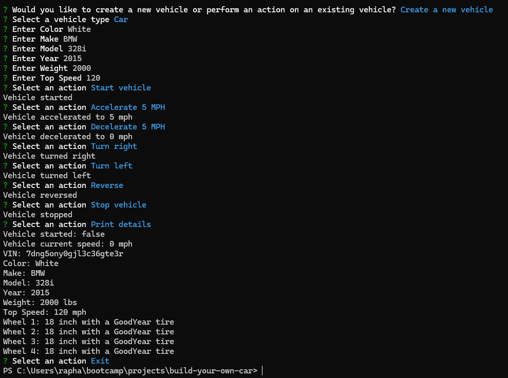

# Build-Your-Own-Car

## Description

Build Your Own Car is a tool that will help you user a premade vehicle or create your own. You can make your own Car, Truck, or Motorbike. There is plenty premade options to choose from as well. Once you have created or chosen your vehicle you will be presented with options to test out your new ride.

## Table of Contents

  - [Installation](#installation)
  - [Usage](#usage)
  - [License](#license)
  - [Demonstration](#demonstration)

## Installation

Once you have git clones the repo to your machine. You can run npm i to install all dependencies. Node.js is required.

## Usage

You can trigger the application using the command npm start.

You will be asked if you would like to Create a car or select an existing one.

If you select to create your own car: 
- You will be asked if you want to make a Car, Truck, or Motorbike
- After choosing one of the options, you will then fill in all the required details you want the vehicle to follow.
- Once you fill it all in, you have your own vehicle!

If you choose to select an existing vehicle:
- You will be presented with options of the default vehicles

This Screenshot shows how it looks to create your own car:

## License

This Application is under the MIT License.

## Demo

You can click this [Link](https://drive.google.com/file/d/1Dp7Hhzj39eiP92WUYKizfDO4DVPYO2dD/view) for a short demo on how to use the application.